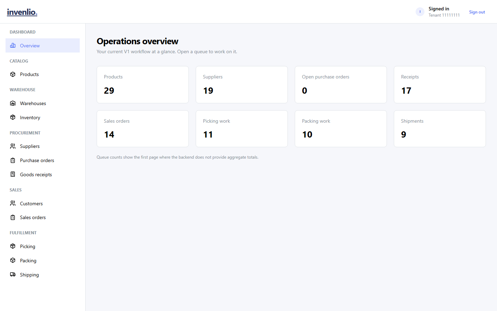
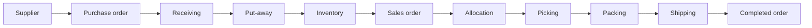
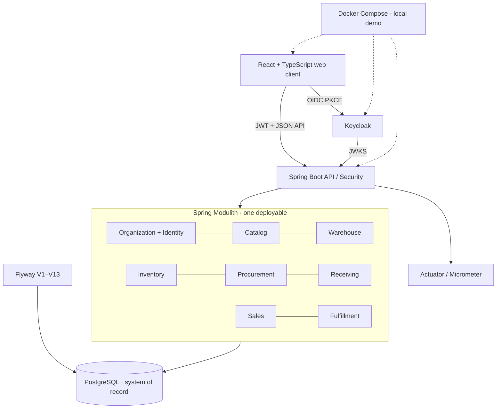

# Invenlio

Production-oriented, multi-tenant order, inventory and warehouse management platform built with Java 21, Spring Boot, PostgreSQL, Keycloak and React. Independently engineered end to end as a release-verified portfolio project—not a claim of customer or Internet-facing production use.

     

The interesting part is the transactional boundary: an immutable physical-stock ledger, synchronous balances, reservation-based allocation, and guarded pick/pack/dispatch transitions share one PostgreSQL authority. The browser exercises the real Keycloak-authenticated workflow; it does not simulate an API.

**Status:** V1.0 is feature-complete for its documented local/demo scope. V1.0.1 aligns release metadata, CI and presentation; V2 capabilities are intentionally deferred. The Compose stack is **not** an Internet-facing production deployment. See [V1.0.0 scope](docs/releases/v1.0.0.md), [V1.0.1 notes](docs/releases/v1.0.1.md) and [deployment responsibilities](docs/operations/runbook.md).

## Engineering highlights

- Shared-schema UUID tenant isolation combines signed context, database membership checks, tenant-scoped queries/foreign keys and cross-tenant tests.
- Keycloak OIDC authorization-code/PKCE login and backend JWT issuer/audience validation; database-backed RBAC is authoritative.
- Immutable inventory movements and ledger entries; exact `NUMERIC(19,6)` quantities and a synchronous balance projection.
- PostgreSQL advisory locks, optimistic versions, uniqueness constraints and durable idempotency keys protect concurrent physical and commercial writes.
- Reservations change available-to-promise, not physical on-hand; FEFO allocation and lot/serial identity persist through fulfillment.
- Spring Modulith and ArchUnit enforce business-capability boundaries without distributing one transaction across services.
- Flyway V1–V13, PostgreSQL/Testcontainers integration tests, authenticated Playwright E2E and backup/restore verification support the release claim.

## Product workflow and invariants

| Area | V1 capability | Rule that matters |
| --- | --- | --- |
| Platform | Organizations, tenant membership, permissions and audit | A JWT tenant claim is not proof of active membership. |
| Catalog & warehouse | Products/SKUs, suppliers, warehouse zones and location hierarchy | Location eligibility is checked before stock posting. |
| Inbound | Supplier mapping, purchase orders, goods receiving and put-away | A purchase order changes no stock; posting a receipt does. Put-away relocates it. |
| Inventory | Immutable ledger, balances, lot/serial/expiry, reservations and ATP | `available = onHand - reserved`; reservations cannot exceed on-hand. |
| Outbound | Customers, sales orders, allocation/backorders, picking, packing and dispatch | Picking relocates stock; packing does not; dispatch removes it and can complete the order. |

Serialized stock cannot have positive on-hand in two locations simultaneously. Dispatch cannot create negative stock. These are server/database invariants, not UI conventions. See the [inventory](docs/domain/inventory.md), [sales](docs/domain/sales-orders.md), [picking/packing](docs/domain/picking-and-packing.md) and [shipping](docs/domain/shipping.md) designs.

## Architecture

A modular monolith keeps module ownership explicit while allowing atomic receiving, allocation and dispatch transactions. It avoids microservice coordination until an extraction driver is demonstrated. Modules communicate through published interfaces/events, not another module's repository. See [architecture](docs/architecture/architecture-overview.md) and [ADR-001](docs/architecture/adr/ADR-001-modular-monolith-first.md).

## Quick start · local evaluation

Prerequisites: **JDK 21**, Docker Engine with Compose v2, and—for web development/tests—**Node.js 22.12+** and **pnpm 11.19.0**. All demo credentials must be local-only; never reuse them elsewhere.

1. Copy `.env.example` to `.env`. Replace its password placeholders with local-only values. Keep `.env` untracked. The default Keycloak port is `8081`; if changed, keep `KEYCLOAK_HTTP_PORT`, `VITE_OIDC_URL`, `OIDC_ISSUER_URI` and `OIDC_JWK_SET_URI` aligned.
2. Run `docker compose -f docker/compose.yml --env-file .env --profile web build`, then `docker compose -f docker/compose.yml --env-file .env --profile web up -d`.
3. Wait for `docker compose -f docker/compose.yml --env-file .env --profile web ps` to show healthy PostgreSQL, Keycloak and backend. Check `http://localhost:8080/actuator/health/readiness`; open **http://localhost:3000**.
4. In your shell set `DEMO_KEYCLOAK_ADMIN_PASSWORD` to the local Keycloak admin value in `.env`, and set fresh local-only `DEMO_ADMIN_PASSWORD` and `DEMO_READONLY_PASSWORD`. Run `./scripts/bootstrap-demo.ps1` (PowerShell). Sign in with `admin@invenlio.local` and the value you chose for `DEMO_ADMIN_PASSWORD`; `readonly@invenlio.local` uses the separate read-only value. The bootstrap is local-profile only.

The demo contains synthetic data only. To evaluate the full workflow, follow the [browser walkthrough](web/README.md#deterministic-v1-smoke-flow). No demo password belongs in Git, Vite variables or this README. The [configuration guide](docs/configuration.md) and [operations runbook](docs/operations/runbook.md) cover alternate ports, environment variables and backup/restore. On Windows run `mvnw.cmd`; on macOS/Linux run `./mvnw`.

## Real application screenshots

Captured at 1440×900 in Chromium against the local Keycloak, Java API and PostgreSQL stack with fictional business records. These are application captures, not mockups. [Regeneration instructions](docs/images/README.md) explain the disposable-demo prerequisite.

| Inbound | Stock and outbound |
| --- | --- |
| [Purchase order](docs/images/purchase-order.png) · [goods receiving / put-away](docs/images/receiving-putaway.png) | [Inventory balance](docs/images/inventory.png) · [allocated sales order](docs/images/sales-order.png) |
| [Picking](docs/images/picking.png) · [packing](docs/images/packing.png) | [Dispatched shipment](docs/images/shipping.png) · [dashboard](docs/images/dashboard.png) |

## Security, concurrency and data

The backend validates JWT signature, issuer, audience and lifetime, then checks active database membership and operation permissions. Every tenant-owned read/write is tenant-scoped; cross-tenant identifiers are concealed. Input validation, bounded pagination, RFC 7807 errors, restricted CORS, correlation IDs and audit records are documented in the [security overview](docs/security/security-overview.md). The local stack is bound to loopback and uses development-mode identity; production needs external secrets, TLS, hardened ingress/Keycloak, network policy, backup retention and operational monitoring. No certification or security audit is claimed.

When two orders compete for the last units, database-backed stock-dimension locking and balance constraints prevent aggregate reservations from exceeding on-hand. Receiving, picking and dispatch use atomic PostgreSQL transactions, durable idempotency and locking; optimistic versions guard lifecycle transitions. Flyway migrations are forward-only, tenant-aware foreign keys and exact numeric columns defend persisted invariants, and the ledger is append-only. See [ADR-013](docs/architecture/adr/ADR-013-immutable-inventory-ledger-and-balance-projection.md), [ADR-015](docs/architecture/adr/ADR-015-inventory-reservations-and-availability-projection.md) and [ADR-021](docs/architecture/adr/ADR-021-shipping-dispatch-removes-physical-inventory.md).

## Verification

Java 21: `./mvnw --batch-mode --no-transfer-progress verify` (Windows: `.\mvnw.cmd`). PostgreSQL integration tests use Testcontainers and validate a fresh Flyway schema plus Hibernate mapping; the suite also covers concurrency, authorization, Modulith and ArchUnit boundaries. In `web/`, run `pnpm install --frozen-lockfile`, `pnpm format:check`, `pnpm lint`, `pnpm typecheck`, `pnpm test` and `pnpm build`. Browser E2E needs the bootstrapped live stack and shell-only `E2E_ADMIN_PASSWORD` / `E2E_READONLY_PASSWORD`: run `pnpm exec playwright install chromium` and `pnpm test:e2e`, or use `./scripts/verify-v1.ps1 -E2E` on Windows. The authenticated browser suite exercises Keycloak login → procurement → receiving → inventory → sales → picking → packing → shipping → completed order, plus read-only authorization and logout. Run it only against a disposable demo tenant.

The [V1.0.1 release notes](docs/releases/v1.0.1.md) record the exact verified counts and remaining limitations; badges above reflect the actual GitHub workflows, not a fabricated coverage metric. [V1.0.0's report](docs/releases/v1.0.0.md) remains a historical snapshot.

## Tech stack and repository map

| Layer | Technology | Directory |
| --- | --- | --- |
| Backend | Java 21, Spring Boot 4, Spring Security, Spring Modulith, JPA, PostgreSQL, Flyway, Testcontainers, ArchUnit | [`backend/`](backend/) |
| Frontend | React 19, TypeScript, Vite, TanStack Query, Mantine, Playwright | [`web/`](web/) |
| Local platform | Keycloak, Docker Compose, GitHub Actions | [`docker/`](docker/) · [`.github/workflows/`](.github/workflows/) |
| Documentation & tools | Domain/architecture/security/operations records, verification and bootstrap scripts | [`docs/`](docs/) · [`scripts/`](scripts/) |

`warehouse-mobile/`, `kubernetes/`, `helm/` and `terraform/` are reserved future boundaries, **not implemented V1 clients or deployment manifests**. Redis and Kafka dependencies are not needed for the synchronous V1 workflow.

## Documentation index

[Architecture](docs/architecture/architecture-overview.md) · [ADRs](docs/architecture/adr/README.md) · [API conventions](docs/api/api-conventions.md) · [security](docs/security/security-overview.md) · [inventory](docs/domain/inventory.md) · [purchase orders](docs/domain/purchase-orders.md) · [receiving](docs/domain/goods-receiving.md) · [sales](docs/domain/sales-orders.md) · [fulfillment](docs/domain/picking-and-packing.md) · [shipping](docs/domain/shipping.md) · [operations](docs/operations/runbook.md) · [release notes](docs/releases/v1.0.1.md).

## Notable engineering decisions

- Modular monolith over premature microservices: one transactional boundary, enforced module ownership.
- PostgreSQL as inventory authority: immutable history plus a synchronously maintained fast balance projection.
- Reservations are commercial claims, distinct from physical stock movements and dispatch.
- Database advisory locks and idempotency records cover cross-instance races, including initially missing balance rows.
- Order-line SKU, price and currency snapshots preserve historical commercial meaning when master data changes.

V2 candidates—returns, invoicing/VAT, carrier integrations, mobile scanning and advanced WMS optimization—are deliberately outside V1. No license is defined yet; public visibility alone does not grant reuse rights.
