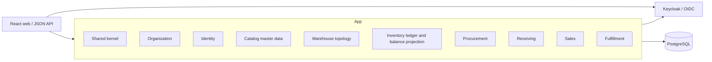

# Invenlio Architecture Overview

## Business objective

Invenlio provides V1 order, inventory, warehouse, procurement and fulfillment workflows for a local/demo environment aimed at European SME and multi-warehouse use cases. Further production hardening and later business capabilities remain separate work.

## Architectural style

The system begins as a domain-driven modular monolith. Business capabilities are top-level Spring Modulith modules beneath `io.invenlio`; each owns its domain model, use cases, and adapters. A small open shared kernel contains genuinely cross-cutting technical policy. Module APIs and domain events replace access to another module's entities or repositories.

Catalog is the first commercial module. It owns products, variants/SKUs, options, categories, brands, barcodes and physical master data. It deliberately contains no inventory or warehouse quantity state.

Warehouse independently owns physical warehouses, zones and location hierarchy. It contains capacity metadata but no occupancy, product reference or inventory quantity.

Inventory owns immutable physical stock movements and a synchronous current on-hand projection. It consumes only published Catalog and Warehouse contracts; neither upstream module depends on Inventory.

Sales owns Customers, Sales Orders, commercial snapshots and reservation-backed allocation links. It consumes published Catalog, Warehouse and Inventory APIs; those upstream modules do not depend on Sales. Allocation changes reserved/ATP only and never writes a physical stock movement.

Fulfillment owns pick lists, pick tasks, packing sessions and packages. It consumes published Sales, Inventory and Warehouse APIs. Inventory owns the atomic reservation consumption and paired physical relocation to packing; Sales owns the separate fulfillment projection. Packing structures stock already at the packing location without changing on-hand. See ADR-020 and `docs/domain/picking-and-packing.md`.

Fulfillment also owns draft and dispatched Shipments. A dispatch derives its stock dimensions from sealed package contents and invokes Inventory's governed outbound posting in the same transaction. Inventory removes on-hand at the packing location with immutable negative ledger history; Sales advances shipped quantities and completes fully shipped orders. See ADR-021 and `docs/domain/shipping.md`.

The V1 backend includes organization, identity, catalog, warehouse, inventory, procurement, receiving, sales and fulfillment modules. Returns, invoicing/EU VAT, external integrations and advanced analytics remain future bounded contexts. The warehouse mobile client is a placeholder, not implemented. Redis and Kafka dependencies exist for future integration work but are not required by the synchronous V1 workflow. Their final boundaries must be discovered and recorded, not inferred from this list.

The `web/` React application is a separate browser client of the public V1 API, not a Spring Modulith module. Keycloak JS handles authorization-code/PKCE login and keeps tokens in memory; TanStack Query owns server state. A read-only `/api/v1/me` projection supplies the active tenant and effective permissions for UX, while the backend enforces every operation. A read-only packing-session list supports resumable browser work. No web component accesses backend persistence directly or implements business rules authoritatively.

## Deployment direction

The documented local deployment is one stateless backend, PostgreSQL, development-mode Keycloak and a static web client in loopback-bound Docker Compose. This is not an Internet-facing production deployment. A production-oriented design would need HTTPS ingress, external secrets, hardened identity and managed PostgreSQL; Kubernetes/Helm/Terraform choices remain open, not implemented V1 infrastructure.

## Persistence

PostgreSQL is the system of record. Modules own their tables even while sharing a physical schema. All changes are forward-only Flyway migrations; Hibernate validates but never creates production schema. Conventions are in `docs/domain/database-conventions.md`. Transactions remain local and atomic inside the monolith. Optimistic locking and database constraints protect invariants where appropriate.

## Messaging

In-process Spring application events decouple modules while retaining transactional consistency. Kafka is reserved for integrations, durable cross-boundary streams, and later extraction. Event publication, idempotency, schema evolution, ordering, retry, and an outbox must be designed before an event is externalized; publishing directly inside an uncommitted transaction is forbidden.

## Multi-tenancy

V1 uses one PostgreSQL database and schema with a mandatory `tenant_id` discriminator on tenant-owned rows. `TenantContext` derives a UUID tenant identifier from an authenticated JWT claim and fails closed when required. Active database membership, tenant-qualified access, constraints and cross-tenant integration tests provide defense in depth for the documented V1 flows; that is not a blanket certification of a future production deployment.

Production isolation would additionally require hardened trusted claim issuance, operational review of every new data path, tenant-safe audit access and evaluation of PostgreSQL row-level security. Frontend filtering never provides isolation. Dedicated databases may later be introduced for enterprise tenants behind tenant-routing ports.

## Security

The backend is an OAuth2/OIDC resource server; Keycloak is the local identity provider. Authorization combines RBAC with fine-grained permissions and tenant membership. MFA belongs at the IdP. Production requires TLS, external secret management, least-privilege service/database identities, dependency/security scanning, rate limiting at gateway and application boundaries, and tamper-evident audit operations. If uploads or personal-data processing are later introduced, their validation, retention and GDPR obligations must be designed explicitly. Use current OWASP ASVS/API Security guidance.

## APIs and integration

Versioned JSON REST APIs follow `docs/api/api-conventions.md`. External integrations use explicit ports and adapters, stable contracts, idempotency, bounded retries, and webhook signatures. No vendor integration is assumed until selected. OpenAPI is generated from implemented endpoints only.

## Observability and logging

Actuator exposes only health, info, and Prometheus endpoints. Liveness indicates process health; readiness includes essential dependencies. Micrometer is the instrumentation API; a vendor-neutral trace bridge and external Prometheus/Grafana/Loki/Tempo deployment remain future operational work. Correlation IDs are propagated in `X-Correlation-ID`. Logs must exclude secrets, tokens, unnecessary PII, and sensitive tenant data; tenant identifiers may be included only where operationally necessary and access-controlled.

## Scalability and extraction

Scale the stateless monolith horizontally first, tune database queries/indexes, isolate expensive workloads asynchronously, and partition data only from measured need. Extract a module only when it has a stable boundary and at least one concrete driver: independent scaling or availability, separate release cadence/ownership, isolation/compliance needs, incompatible technology, or sustained operational contention. Before extraction, prove contract ownership, remove database joins, introduce reliable event delivery, define failure semantics, and quantify the added operational cost.
