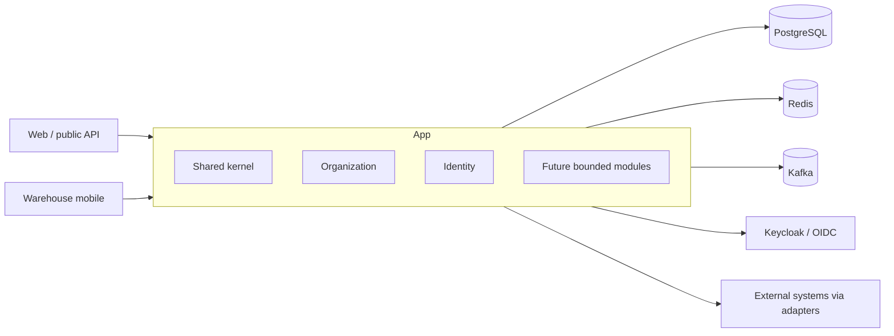

# Invenlio Architecture Overview

## Business objective

Invenlio will provide commercial order, inventory, and warehouse management for European SMEs and multi-warehouse operators. TASK-001 establishes an honest foundation only; none of the future operational domains are implemented.

## Architectural style

The system begins as a domain-driven modular monolith. Business capabilities are top-level Spring Modulith modules beneath `io.invenlio`; each owns its domain model, use cases, and adapters. A small open shared kernel contains genuinely cross-cutting technical policy. Module APIs and domain events replace access to another module's entities or repositories.

The initial executable contains only `shared`, `organization`, and `identity`. Candidate future bounded contexts include catalog/products and variants; customers; suppliers/purchasing; warehouses/zones/bins; immutable inventory ledger/reservations/transfers/counting; receiving/put-away; sales orders/allocation; picking/waves/packing/shipping; returns; invoicing/EU VAT; portals; integrations/webhooks/notifications; analytics and forecasting. Their final boundaries must be discovered and recorded, not inferred from this list.

## Deployment direction

Initially, one stateless backend deployment serves HTTPS APIs and runs domain workflows, backed by managed PostgreSQL, Redis, Kafka, and an external Keycloak installation. Horizontal application scaling is expected. Environment configuration and secrets come from the deployment platform. Kubernetes/Helm/Terraform choices remain open.

## Persistence

PostgreSQL is the system of record. Modules own their tables even while sharing a physical schema. All changes are forward-only Flyway migrations; Hibernate validates but never creates production schema. Conventions are in `docs/domain/database-conventions.md`. Transactions remain local and atomic inside the monolith. Optimistic locking and database constraints protect invariants where appropriate.

## Messaging

In-process Spring application events decouple modules while retaining transactional consistency. Kafka is reserved for integrations, durable cross-boundary streams, and later extraction. Event publication, idempotency, schema evolution, ordering, retry, and an outbox must be designed before an event is externalized; publishing directly inside an uncommitted transaction is forbidden.

## Multi-tenancy

The initial model is one PostgreSQL database and schema with a mandatory `tenant_id` discriminator on tenant-owned rows. `TenantContext` derives a UUID tenant identifier from an authenticated JWT claim and fails closed when required. This is scaffolding, not complete isolation.

Production isolation must be defense in depth: trusted tenant claims issued by the IdP; tenant-aware authorization; repository/query constraints that cannot be accidentally omitted; database constraints/indexes and possibly PostgreSQL row-level security after evaluation; automated cross-tenant integration tests; and tenant-safe audit records. Frontend filtering never provides isolation. Dedicated databases may later be introduced for enterprise tenants behind tenant-routing ports.

## Security

The backend is an OAuth2/OIDC resource server; Keycloak is the planned identity provider. Authorization combines RBAC with fine-grained permissions and tenant membership. MFA belongs at the IdP. Production requires TLS, external secret management, least-privilege service/database identities, dependency/security scanning, safe upload quarantine/content validation, rate limiting at gateway and application boundaries, and tamper-evident audit trails. Data minimization, retention/erasure workflows, access/export, subprocessors, and breach operations must support GDPR. Use current OWASP ASVS/API Security guidance.

## APIs and integration

Versioned JSON REST APIs follow `docs/api/api-conventions.md`. External integrations use explicit ports and adapters, stable contracts, idempotency, bounded retries, and webhook signatures. No vendor integration is assumed until selected. OpenAPI is generated from implemented endpoints only.

## Observability and logging

Actuator exposes only health, info, and Prometheus endpoints. Liveness indicates process health; readiness includes essential dependencies. Micrometer is the instrumentation API and OpenTelemetry is the intended vendor-neutral trace/metric bridge. Prometheus/Grafana, Loki, and Tempo are the deployment direction, not deployed in TASK-001. Correlation IDs are propagated in `X-Correlation-ID`. Logs must exclude secrets, tokens, unnecessary PII, and sensitive tenant data; tenant identifiers may be included only where operationally necessary and access-controlled.

## Scalability and extraction

Scale the stateless monolith horizontally first, tune database queries/indexes, isolate expensive workloads asynchronously, and partition data only from measured need. Extract a module only when it has a stable boundary and at least one concrete driver: independent scaling or availability, separate release cadence/ownership, isolation/compliance needs, incompatible technology, or sustained operational contention. Before extraction, prove contract ownership, remove database joins, introduce reliable event delivery, define failure semantics, and quantify the added operational cost.

