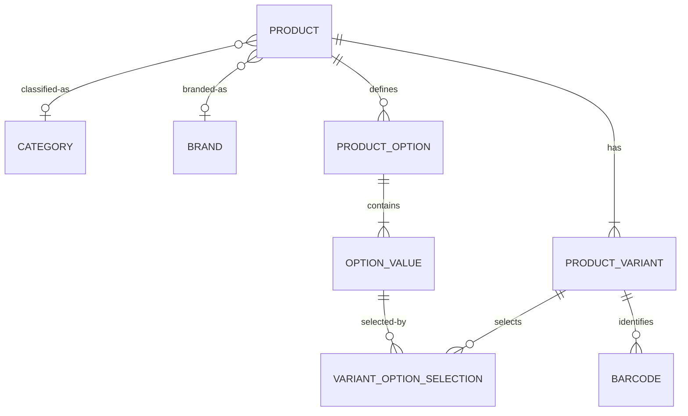

# Catalog domain

Catalog owns **what an item is**, never where it is or how many exist.



## Products and variants

Every operational item is a ProductVariant/SKU. Creating a simple product atomically creates its sole `DEFAULT` variant; clients need not understand option mechanics. Configurable products define ordered options and values. Variant selections are relational, allow one value per option, and create a deterministic unique combination. Combinations are not generated automatically.

Products and variants transition `DRAFT → ACTIVE → INACTIVE ↔ ACTIVE`; DRAFT and INACTIVE may be archived, and ARCHIVED is terminal. SKUs are normalized uppercase with whitespace converted to hyphens, unique across the tenant for all history, and mutable only while DRAFT.

## Categories and brands

Categories form a tenant-scoped adjacency hierarchy returned as flat DTOs with `parentId`. Updates walk ancestors iteratively with a visited set, rejecting self and multi-level cycles. Sibling names and slugs are normalized and unique. Brands are lightweight tenant-local master data. Both archive rather than delete; restrictive foreign keys prevent destructive cascades.

## Barcodes and physical data

Barcodes belong to variants and remain unique across a tenant even after deactivation. GTIN-8, GTIN-12/UPC-A, GTIN-13/EAN-13 and GTIN-14 use GS1 Mod-10 validation. CODE_128 and INTERNAL are opaque normalized identifiers. A variant has zero or one active primary barcode, enforced atomically and with a partial unique index.

Weight persists exactly in grams; length, width and height in millimetres. Supported base UOM codes are `EA`, `KGM`, `GRM`, `LTR`, `MLT`, `MTR`, `CMT`, `BX`, `PK`, and `PF`, with labels exposed by the domain enum. Conversion is deferred. Optional standard cost/list price columns use exact decimal plus ISO currency, but the initial API defers price mutation until pricing ownership is specified.

## Security and boundaries

The authenticated JWT selects a tenant, while database membership and stable permissions authorize it. Reads use `catalog:read`; product/variant creation, updates and archival use their matching permissions; category and brand mutations use dedicated manage permissions. Every application lookup includes tenant ID, relationship IDs are resolved in the same tenant, collection size is capped at 100, and sort fields are allow-listed.

Catalog publishes in-process Spring events and writes meaningful changes through the organization audit API in the same transaction. It never accesses organization repositories/entities.

Inventory quantities, warehouse locations, supplier SKUs, sales price lists, images/media, CSV bulk import, and GS1 AI parsing are explicitly deferred. Future inventory references variant UUID and follows ADR-006's immutable ledger; media will use object storage rather than PostgreSQL.

## API example

```json
{
  "name": "USB-C Cable 2m",
  "categoryId": "4ed45889-94ef-4d50-a86e-d777403865ca",
  "brandId": "590a74b8-3a93-46fb-b820-05eea8ee8b7c",
  "baseUnit": "EA",
  "initialVariant": { "sku": "CAB-USBC-2M", "weightGrams": 120 }
}
```

Product search supports `q`, `status`, `categoryId`, `brandId`, `page`, `size` (maximum 100), and allow-listed `sort` values `name`, `createdAt`, `updatedAt`. Exact scanner-oriented lookup uses `/api/v1/catalog/lookup?sku=…` or `?barcode=…`, exactly one at a time.
