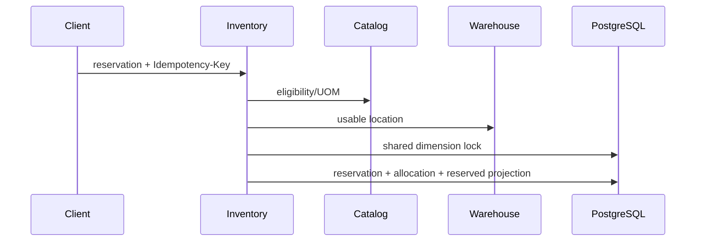

# Inventory reservations

Reservations are commercial claims, not physical movements. Reservation headers plus immutable allocation rows are authoritative; `inventory_balances.reserved_quantity` is a synchronous projection. `available = onHand - reserved`; ATP further excludes operationally ineligible warehouses, locations, lots and serials.

Exact traceability dimensions follow ADR-014. Expired or blocked identities remain on hand but are not reservable. Inactive warehouses, non-active locations, inactive variants, and blocked, archived, or expired traceability identities contribute zero ATP. Creation, release and expiry never write ledger entries. Physical decrements and reservations take the same deterministic dimension advisory lock, and PostgreSQL enforces `0 <= reserved <= onHand`.

ACTIVE reservations may become terminal RELEASED or EXPIRED. A bounded scheduled worker selects overdue rows with `FOR UPDATE SKIP LOCKED`, allowing recovery after downtime and safe multi-instance execution. Idempotency is tenant scoped and operation specific with canonical SHA-256 fingerprints. The bounded reconciliation diagnostic compares the projection with ACTIVE allocation sums; a controlled maintenance process can rebuild it, while normal reads never silently repair it. The read-only candidate endpoint orders eligible dimensions by lot expiry (null last), lot identity, warehouse code, location sequence/code, and serial identity. It does not allocate. Sales Order owns why stock is needed and consumes Inventory's published boundary using `SALES_ORDER_LINE`; Inventory owns eligibility, locking, reservation mechanics and release. Picking and later fulfillment movements remain deferred.
