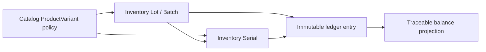

# Inventory traceability

Catalog owns the immutable-after-activation tracking policy: `NONE`, `LOT`, `SERIAL`, or `LOT_AND_SERIAL`. Existing variants migrate as `NONE`. `expirationRequired` is valid only for lot modes. Inventory owns Lot (batch synonym) and Serial identities; registering identity never creates stock.

The exact matrix is: NONE forbids both IDs; LOT requires only lot; SERIAL requires only serial; LOT_AND_SERIAL requires both and the serial must belong to that lot. Lot/serial identifiers are normalized case-insensitively without removing punctuation and are immutable. Mutable dates/lifecycle use optimistic versions. BLOCKED identities can receive administrative corrections; ARCHIVED identities cannot. A lot/serial with positive on-hand cannot archive.

Balances are keyed by tenant, variant, warehouse, location, lot and serial using PostgreSQL `NULLS NOT DISTINCT`. Serial posting takes a tenant/serial advisory lock: deltas are ±1 and global physical presence cannot exceed one. Lots can span locations. Expiry is derived from `expiresOn` and does not write off physical stock automatically.

Indexes support exact identity lookup, expiry-ordered lot reads, traceable ledger history, positive balances and FEFO candidate queries. Allocation, receiving and picking now use these traceability dimensions. General transfers, GS1 AI parsing, recalls and warranties remain future workflows; manual -1 then +1 postings are administrative corrections, not a transfer workflow.
