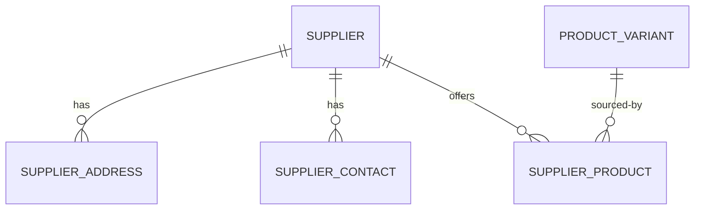

# Procurement supplier master data

Procurement owns suppliers and their commercial relationship to Catalog variants. Catalog remains independent; Procurement consumes its published variant lookup contract. No supplier operation changes inventory, reservations, or the immutable ledger.

Suppliers use stable tenant-unique normalized numbers and explicit `DRAFT`, `ACTIVE`, `INACTIVE`, `BLOCKED`, and terminal `ARCHIVED` lifecycle states. Numbers are editable only in DRAFT. Structured addresses allow one active primary per type; contacts allow one active primary per role. Ownership is immutable and normal business operations never hard-delete records.

SupplierProduct maps an immutable supplier and Catalog variant to a normalized supplier SKU. One relation exists per supplier/variant and one supplier SKU per supplier. At most one active preferred relation exists per tenant/variant. Deactivation clears preference; blocked or inactive suppliers remain historical but are excluded by the purchasing-eligibility contract.

Purchase packaging uses an exact `purchaseUnitCode` plus `baseUnitsPerPurchaseUnit`; this deliberately supports a single direct conversion rather than a conversion graph. MOQ and order multiple are measured in purchase units. Current unit cost is exact `NUMERIC(19,6)` per purchase unit with ISO 4217 currency. Lead time is calendar days, with a relation override falling back to the supplier default.

Future purchase orders will snapshot supplier SKU, purchase unit/conversion, price/currency, and the chosen ordering address so historical documents do not depend on mutable master data. Purchase orders, receiving, invoices, replenishment, and integrations are deferred.

All operations authorize `procurement-supplier:read` or `procurement-supplier:manage`, derive tenant ownership from authenticated membership, use tenant-aware foreign keys, return DTO records, bound collection reads to 100, allow-list sorting, audit mutations, and use optimistic versions.
