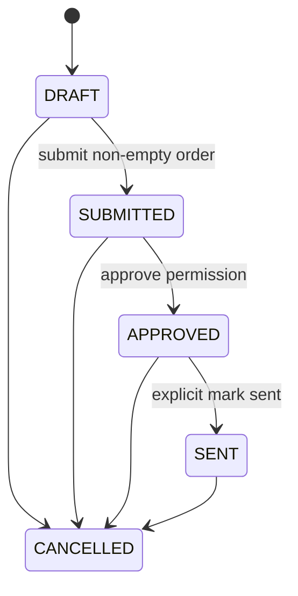

# Purchase orders

Procurement owns the PurchaseOrder aggregate. A PO is commercial intent only: creating, editing, submitting, approving, marking sent, or cancelling never posts Inventory movements, ledger entries, balances, reservations, receipts, or put-away work.

PO numbers use an atomic tenant/year PostgreSQL counter and format `PO-YYYY-NNNNNN`; gaps after rollback are acceptable. Supplier and active destination warehouse are tenant validated. Supplier identity and warehouse display data are snapshotted on creation. Lines reference one eligible SupplierProduct each and snapshot supplier SKU, Catalog SKU/display name, purchase unit, exact conversion, cost, currency, and expected date. Later master-data changes do not rewrite PO history.

Ordered quantity is expressed in purchase units at scale 6. Base quantity equals ordered quantity multiplied by the snapshotted conversion and must be integral for discrete Catalog base units. MOQ and order multiple are evaluated in purchase units using exact decimal arithmetic. All lines use the header currency; FX is unsupported. Subtotal and total are tax-exclusive and equal in TASK-009, calculated server-side at scale 6 using `HALF_UP` only where multiplication needs rounding.

Draft headers and lines are editable; submission requires at least one line and freezes commercial data. Approval is a distinct `purchase-order:approve` permission; self-approval remains allowed because no configurable four-eyes policy exists. `SENT` is an explicit administrative state and does not claim email delivery. Cancellation is retained with actor, time, and a bounded reason. `CLOSED` and receiving states are deferred until their semantics exist.

The public `PurchaseOrderAccess` contract exposes APPROVED and SENT orders for future Receiving without received quantities. TASK-010 should own receipt execution and coordinate inventory posting without making Inventory depend directly on Procurement.
