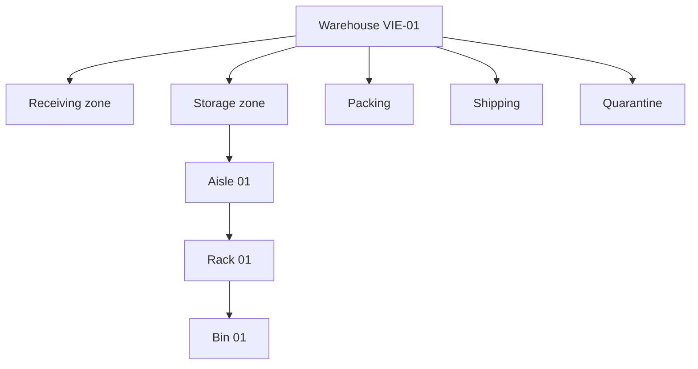

# Warehouse domain

Warehouse owns where goods **may** exist; Catalog owns what an item is; future Inventory owns how much exists at a location.

Warehouses have normalized tenant-unique codes, names, IANA timezones, structured ISO-alpha-2 addresses and optimistic versions. Codes may change only in DRAFT. Lifecycle is `DRAFT → ACTIVE → INACTIVE ↔ ACTIVE`; DRAFT/INACTIVE may archive and ARCHIVED is terminal.

Zones group operational areas using RECEIVING, STORAGE, PICKING, PACKING, SHIPPING, RETURNS, QUARANTINE, DAMAGED, QUALITY_CONTROL, STAGING or TRANSIT. Codes are unique per warehouse. Locations use an adjacency list, optional parent, deterministic sequence, and types AISLE, RACK, SHELF, BIN, FLOOR, PALLET_POSITION plus intentional operational types. VIRTUAL is deferred because its semantics belong with inventory movement.

Parent, zone and operational-default references use tenant+warehouse composite foreign keys. Moves iteratively walk ancestors with a visited set. Cross-tenant, cross-warehouse, self and descendant parenting fail. Archiving a parent with non-archived children is rejected. Operational defaults are controlled assignments for receiving, shipping, returns, quarantine and damaged areas and require a matching location type.

Scan codes are canonical uppercase identifiers, unique across a tenant for unambiguous mobile lookup. No images or label printing are included. Capacity is descriptive only: maximum grams, cubic millimetres and pallet positions; occupancy is not calculated. Standard lists are paginated to 100. Flat topology is sequence ordered and capped at 20,000 records to avoid recursive entity graphs and N+1 queries; subtree/cursor APIs or `ltree` may follow measured need.

Warehouse search supports tenant-scoped name/code text and status filters. Zone lists support type/status filters; location lists support zone, parent, type, status, exact code and text search. All collection sorts are restricted to documented fields, include an identifier tie-breaker, and reject page sizes above 100.

Warehouse PATCH updates only explicit master-data and address fields. Zone PATCH updates code, name, type and sequence. Location PATCH deliberately excludes tenant, warehouse, parent, lifecycle, code and scan identity; it updates only zone, label/type/order, capacity and millimetre dimensions. Parent changes use the dedicated move operation. Zone archival requires all locations in the zone to be archived first.

The public OpenAPI contract documents create/read/update/lifecycle operations, hierarchy moves, scan lookup, topology, operational defaults, filters, pagination and sorting. Domain failures use RFC 7807 with stable codes. Meaningful audit records distinguish `warehouse`, `warehouse-zone` and `warehouse-location` entity types.

Permissions are `warehouse:read/create/update/archive` and `warehouse-location:read/manage`. Authorization resolves the authenticated tenant and database membership before every use case. Organization administrators receive all; READ_ONLY and AUDITOR receive read permissions. Meaningful mutations are audited and publish in-process events.

No quantities, balances, reservations, products, variants, receiving transactions, picking, routing, refrigeration monitoring or hazardous-goods compliance are implemented. Future put-away will combine product requirements, location capability/capacity, occupancy and strategy. Future pick routing may use zone/location sequence without changing this topology.
