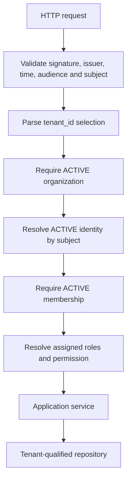

# Identity, organization authorization, and audit

An **Organization** is a customer company and the SaaS tenant. `tenant_id` is its persistence discriminator. A **User identity** is the minimal link to a Keycloak subject; Invenlio stores no passwords. An **Organization membership** joins an identity to an organization. A **Role** is an organization-scoped group of stable fine-grained **permissions**.

Keycloak owns authentication, passwords, MFA, login sessions, recovery, and future federation. PostgreSQL owns organizations, memberships, tenant selection, roles, permissions, authorization, and audit. JWT role claims are not tenant authorization evidence.

Missing/malformed context, inactive records, and missing permissions fail closed. Client identifiers never replace the current tenant in repository queries, preventing BOLA/IDOR access.

Organizations have immutable IDs and slugs. Settings use optimistic versions; locale, IANA timezone and ISO 4217 currency are validated. Membership transitions are `INVITED → ACTIVE|REMOVED`, `ACTIVE → SUSPENDED|REMOVED`, and `SUSPENDED → ACTIVE|REMOVED`; `REMOVED` is terminal. One identity has at most one membership per organization.

Permissions are global code contracts; roles and assignments are tenant-scoped. Local bootstrap creates `ORGANIZATION_ADMIN`, `AUDITOR`, and `READ_ONLY`. Audit events are insert-only through application behavior and tenant-scoped on reads. Source IP is omitted because trusted forwarding is not configured.

TASK-002 supplies development-only idempotent SQL bootstrap after migrations. Commercial onboarding will use a controlled operator-authorized provisioning use case; its external interface is deferred until the operator/onboarding boundary is selected. No unauthenticated admin-creation endpoint exists.
